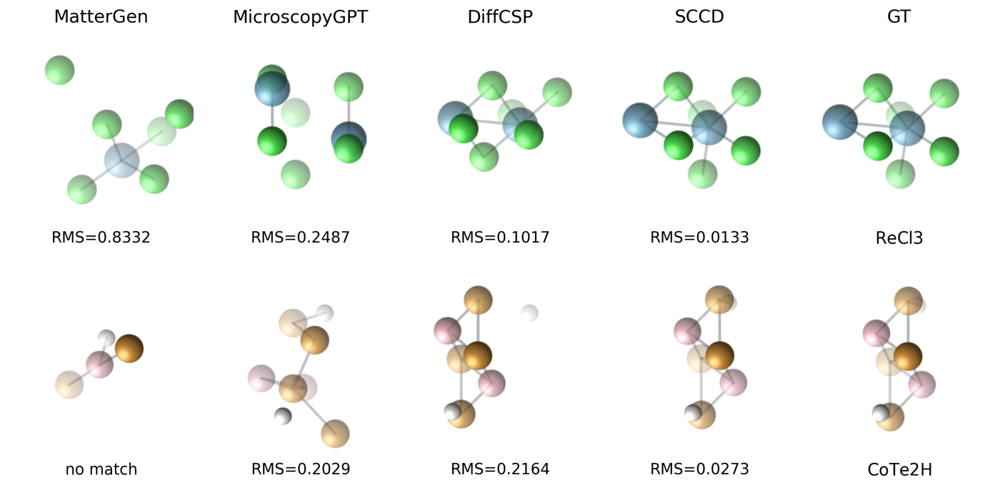

<div align="center">


# STEM2Crystal-Bench

Microscopy-guided crystal structure reconstruction: recover a simulation-ready crystal structure
(CIF) from a single noisy STEM image when the composition is known.

[](LICENSE)
[](pyproject.toml)
[](https://huggingface.co/datasets/gary23ai/STEM2Crystal-Bench)
[](https://peesegroup.github.io/STEM2Crystal-Bench/)
[](https://peesegroup.github.io/STEM2Crystal-Bench/)

[Live leaderboard](https://peesegroup.github.io/STEM2Crystal-Bench/) ·
[Dataset](https://huggingface.co/datasets/gary23ai/STEM2Crystal-Bench) ·
[Docs](docs/) · [Paper (KDD 2026, Oral)](#citation)

</div>

Electron microscopy resolves individual atoms, yet turning an image into a usable material description
(a structure, and from it properties) still relies on slow, manual reconstruction. The longer-term aim
is a direct bridge from microscopy to materials: generate the structure straight from the image, then
analyze it end to end. STEM2Crystal-Bench targets the first and hardest link in that bridge: recovering
a simulation-ready crystal structure from a single noisy STEM image when the composition is known.

## Benchmark

STEM2Crystal-Bench supplies paired data and one scoring protocol for this task. A method takes the STEM
image and the known composition and returns one or more candidate CIFs, which are scored against the
ground truth.

- a synthetic set of 1021 structures rendered at three controlled noise levels (low / mid / high), and
- a small set of real STEM images of 2D monolayers with single-layer ground truth.

Predictions are scored by reconstruction success (Hit@1, Hit@5), geometric error (MinRMS@K, RMSD),
absolute-scale agreement (Match_abs, W₁), symmetry accuracy (SG-Acc), and a failure-mode breakdown
(see [Metrics](#metrics)). The dataset, its noise model, and the splits are documented in
[docs/benchmark.md](docs/benchmark.md).

## What is here

- `stem2crystal/data`: download the benchmark and resolve its file paths.
- `stem2crystal/eval`: the metrics and a function that scores a directory of predictions. It contains
  no model code, so it scores any method's output the same way.
- `stem2crystal/methods`: the `Method` interface and a registry. Several methods are included as
  reference implementations (SCCD, DiffCSP, MicroscopyGPT, MatterGen); they are starting points, not
  the scope; any model that outputs CIFs can be run and scored. `_sccd_impl/` holds SCCD's training
  and sampling scripts.
- `scripts/`: `download_benchmark.py`, `download_models.py`, `generate.py`, `evaluate.py`.

Downloaded data, weights, and generated predictions are git-ignored and live in local `data/`,
`outputs/`, and `predictions/` directories.

## Quickstart

```bash
pip install -e .
python scripts/download_benchmark.py --config all     # benchmark -> ./data
```

Score a directory of predictions (any method) against the benchmark:

```bash
python scripts/evaluate.py --pred predictions/sccd/low --benchmark synthetic --name SCCD
```
```
Method                   Hit1         Hit5   MinRMS_median  MinRMS_mean   Match_abs       RMSD_A       SG_Acc        W1_b     W1_gamma
SCCD                   0.5867       0.8217          0.0536       0.1206      0.7855       0.2063       0.2693       0.1331       2.0072
failure modes: {'formula': 0.0, 'wrong_lattice': 0.135, 'lattice_ok_wrong_SG': 0.034, 'coord_other': 0.009}
```

Run a built-in method end to end:

```bash
python scripts/download_models.py --model diffcsp           # weights -> ./outputs
python scripts/generate.py --method diffcsp --benchmark synthetic --noise low
python scripts/evaluate.py --method diffcsp --benchmark synthetic --noise low
```

The built-in methods are `sccd`, `diffcsp`, `microscopygpt`, and `mattergen`. Each wraps its upstream
model and downloaded weights; see [docs/methods.md](docs/methods.md).

## Add a model

Implement one method, register it, and the evaluator scores it like the others:

```python
from stem2crystal.methods import Method, register_method

@register_method("my_model")
class MyModel(Method):
    def setup(self):
        self.net = load_ckpt(self.config["ckpt"])

    def generate(self, image, composition, k=5):
        return my_sampler(self.net, image, composition, k)   # -> list[pymatgen.Structure]
```
```bash
python scripts/generate.py --method my_model --method-module my_model.py --benchmark synthetic
python scripts/evaluate.py --method my_model --benchmark synthetic
```
See [docs/add_a_method.md](docs/add_a_method.md) for the full contract.

## Qualitative comparison

Each method's rank-1 reconstruction next to the ground truth, labelled with the RMS to GT (two
samples from the synthetic set; figure from the paper):

<p align="center"></p>

Regenerate it from your own predictions:

```bash
pip install -e ".[viz]"          # adds ase + matplotlib
python scripts/plot_comparison.py --benchmark synthetic --noise low \
    --methods mattergen microscopygpt diffcsp sccd \
    --samples <sid1> <sid2> --out comparison.png
```

## Metrics

The suite reports the metrics from the paper (§5.2):

| Metric | Definition |
|---|---|
| Hit@1 / Hit@5 | top-1 / best-of-K reconstruction success (scale-normalized matcher) |
| MinRMS@K (median, mean) | smallest scale-normalized RMS over formula-matched candidates |
| Match_abs | match rate with cell rescaling disabled (exposes absolute-scale errors) |
| RMSD (Å) | absolute-Ångström structural RMS |
| SG-Acc | top-1 space-group accuracy (spglib 3D number, not the 2D layer group) |
| W₁(b), W₁(γ) | 1-D Wasserstein-1 distance between predicted and reference lattice marginals |
| failure modes | formula / wrong-lattice / lattice-ok-wrong-SG / coord-other |

Each metric is a pure function in [`stem2crystal/eval/metrics.py`](stem2crystal/eval/metrics.py),
aggregated by [`stem2crystal/eval/evaluate.py`](stem2crystal/eval/evaluate.py). This list is a starting
point, not a fixed set: a new metric is just another function over the ground-truth and candidate
structures (for example property-level error or thermodynamic stability), and additions are welcome.

## Documentation

[benchmark](docs/benchmark.md) · [installation](docs/installation.md) · [user guide](docs/user_guide.md) ·
[methods](docs/methods.md) · [add a method](docs/add_a_method.md)

## Contributing

The benchmark is small on purpose, and it should not stay that way. Three ways to help:

- **Methods.** Wrap your model in the `Method` interface ([docs/add_a_method.md](docs/add_a_method.md))
  and open a pull request that adds your row to [`leaderboard.json`](leaderboard.json), with a link to
  predictions that reproduce it.
- **Data.** New material classes (beyond 2D slabs), more real STEM images, and harder cases make the
  benchmark more useful. Propose additions on the
  [dataset page](https://huggingface.co/datasets/gary23ai/STEM2Crystal-Bench) or open an issue.
- **Metrics.** Add a metric as a pure function in [`stem2crystal/eval/metrics.py`](stem2crystal/eval/metrics.py)
  (property-level error, stability, a different matcher) and open a pull request.

## Citation

```bibtex
@inproceedings{chen2026stem2crystal,
  title     = {From Noisy STEM to Crystal Structure: Evidence-Structure CoDiffusion under Composition Constraints},
  author    = {Chen, Guangyao and You, Fengqi},
  booktitle = {Proceedings of the 32nd ACM SIGKDD Conference on Knowledge Discovery and Data Mining (KDD)},
  year      = {2026},
  note      = {Oral presentation}
}
```
If you use the Real-5 images or a baseline method, please also cite the corresponding source papers.

## License

Code is MIT ([LICENSE](LICENSE)). The benchmark is CC BY 4.0 / CC BY 3.0; see the dataset card.
